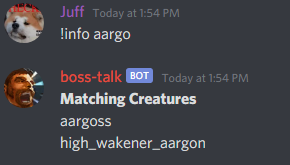
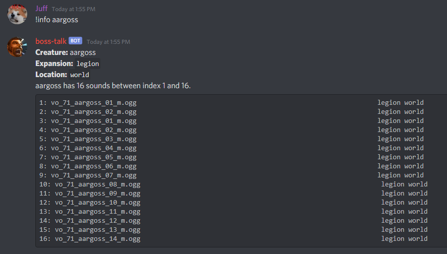
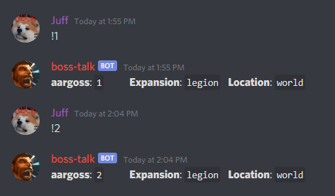

# Boss Talk Search using Algolia

With over 80,000 sounds from World of Warcraft, it can be hard to find the right one. Using Algolia, I built a website to facilitate faster and easier searches.

Try it out! Search by Boss (`lich king`), Expansion (`bc`), or Dungeon/Instance (`icc`).

[bosstalk.dev](https://bosstalk.dev)

This is a companion website to [BossTalk](https://github.com/JeffCSlentz/BossTalk), a Discord bot that plays World of Warcraft sounds.

## The Problem

Using the discord bot alone makes searching for a specific sound tedious. The full user flow is shown below:

First, a user has to search for creatures with `!info creature_name`. Partial matches are then listed out.

With an exact match, like `!info aargoss`, the creature and it's sounds can then be displayed.

Finally, the user has to type out each sound id they'd like to try.

## The Solution

With a front end powered by Algolia's search, [bosstalk.dev](https://bosstalk.dev) lets a user search and test out sounds quicker and easier.

## Improvements

+ The website isn't responsive to mobile portrait layouts yet.
+ The Algolia search index should be by sound instead of creature, with deduplication enabled.

## Feedback for Algolia

The ease of uploading data to Algolia was great. The amount of options were a bit overwhelming, but it was all well organized and the documentation was, of course, easy to search. 

Actually implementing the search from the website was incredibly easy. There were only a few options to provide liek an api-key and index name. The search results (hits) came back in an easy to understand object structure. 

In the short amount of time I worked on the project, I unfortunately couldn't find a way to flatten my Algolia index without writing a lot more front-end code.

## Customer Questions

[Here are the sample customer questions answered](customer-questions-answered.md)